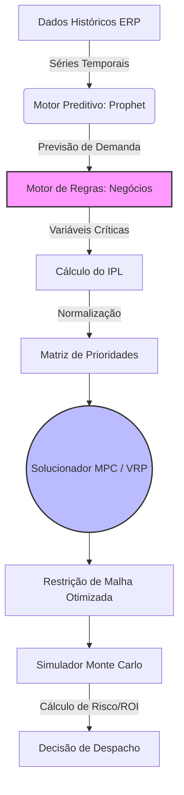

# 📊 Relatório Gerencial de Roteirização Preditiva
**Eduardo Lopes Jonker**
*Disciplina: Sistemas Inteligentes*
*UDESC*
*Relatório gerado em: 2026-04-28 09:15:12.577742*

    
Este documento consolida os resultados do sistema de roteirização preditiva, oferecendo uma prova de conceito visual e quantitativa da metodologia aplicada. O objetivo é fornecer uma visão conclusiva e menos abstrata sobre a otimização logística.

---

## 1. Análise Preditiva de Demanda

A primeira etapa consiste em prever a volumetria de impressões para os próximos 30 dias. Isso transforma nossa logística de reativa para **preditiva**.

### 1.1. Projeção de Volume Futuro

O gráfico abaixo mostra a tendência de volume projetada (`yhat`) em azul, com base nos dados históricos (pontos pretos). A área sombreada representa o intervalo de confiança da previsão para os próximos 30 dias.

!Previsão Geral de Volume (30 Dias)

**Insight Chave:** O volume total de impressões esperado para os próximos 30 dias é de **50,353 unidades**.
**Acurácia do Modelo (MAPE):** No período de treinamento, o modelo demonstrou uma acurácia de **5.07%** (Média de Erro Percentual Absoluto). Valores menores de MAPE indicam maior confiabilidade na aprendizagem do modelo.

### 1.2. Decomposição e Análise de Sazonalidade

Para entender *por que* o volume flutua, o modelo decompõe a série temporal em seus componentes: tendência, feriados e sazonalidade semanal/anual.


**Interpretação Detalhada dos Componentes:**
O Prophet isola a previsão final em diferentes "pesos" autônomos (subgráficos), o que nos ajuda a responder o *porquê* de um volume estar alto ou baixo em determinado dia:
- **Trend (Tendência Geral):** Desconsidera as flutuações diárias e mostra apenas se, no longo prazo, o volume global de impressões daquela cidade está em expansão ou retração. É o crescimento ou queda não-periódica do volume de impressões ao longo do tempo. O modelo identifica "pontos de mudança" (*changepoints*) onde a taxa de impressão de uma cidade subitamente aumenta ou diminui.
- **Holidays (Feriados):** Demonstra como o modelo "amortece" ou joga o volume para cima nos dias mapeados como feriados nacionais (`BR`). Feriados recebem parâmetros próprios, aplicando um "peso de correção" para amortecer o volume esperado.
- **Weekly (Semanal):** Exibe a oscilação de produtividade padrão dentro da semana (ex: picos entre terças e sextas-feiras, com quedas bruscas nos finais de semana). Identifica que terças e quartas podem ter um pico de peso máximo, enquanto sábados e domingos têm peso negativo ou nulo na produção de impressões.
- **Yearly (Anual):** Mostra a "onda" de impacto ao longo dos meses. Valores acima da linha central representam meses que puxam a demanda para cima, enquanto valores abaixo indicam meses de calmaria sazonal. Este componente nos permite identificar os meses de alta e baixa demanda, auxiliando no planejamento estratégico de recursos e férias da equipe.

---

### 1.3. Previsões de Longo Prazo (120 Dias)

Para uma visão mais estratégica e de planejamento de capacidade, o modelo também projeta a demanda para os próximos 120 dias.

!Previsão de Volume (120 Dias)

---

## 2. Otimização de Rotas e Priorização Logística

### 2.1. Índice de Prioridade Logística (IPL)

O sistema utiliza o Índice de Prioridade Logística (IPL) para otimizar o custo global versus o risco de SLA. Este índice normaliza métricas distintas (0 a 1) e distribui o peso operacional matemático.

!Gráfico de Prioridade IPL

**Insight Chave:** A cidade com maior prioridade para a próxima rota é **FLORIANÓPOLIS**, com um IPL de **0.76**.

### 2.2. Contribuição dos Fatores para o IPL

O gráfico abaixo detalha como cada fator (Volume, Tipo de Serviço, Performance e Logística) contribui para o IPL das 5 cidades com maior prioridade.

!Gráfico de Contribuição do IPL

**Insight de Gestão:** A análise da contribuição dos fatores para o IPL permite entender os motivadores da prioridade de cada cidade, direcionando ações específicas para otimização.

Com base na previsão de demanda anual e considerando que cada toner tem capacidade para **10000 cópias**, estimamos a necessidade anual de troca de toners por localidade. Esta informação é vital para o planejamento de estoque e suprimentos.


| Cidade | Volume Anual Previsto | Trocas de Toner Anual |
| :----- | :-------------------- | :-------------------- |
| FLORIANÓPOLIS | 102536 | 10.25 |
| BLUMENAU | 97221 | 9.72 |
| ITAJAÍ | 73110 | 7.31 |
| CHAPECÓ | 69870 | 6.99 |
| CRICIÚMA | 55189 | 5.52 |
| JARAGUÁ DO SUL | 47768 | 4.78 |
| LAGES | 40606 | 4.06 |
| BRUSQUE | 36037 | 3.60 |
| TUBARÃO | 25796 | 2.58 |
| CONCÓRDIA | 17953 | 1.80 |


**Insight de Gestão:** A cidade com maior prioridade para a próxima rota é **FLORIANÓPOLIS**, com um IPL de **0.76**. Ela é projetada para necessitar de aproximadamente **10.25 trocas de toner anualmente**, destacando a importância de um planejamento de suprimentos focado nas localidades de maior demanda.

---

## 4. Análise de Viabilidade Financeira (ROI)

O simulador financeiro (`testestress.py`) executa iterações randômicas para comparar o custo logístico base (Cenário Atual) contra o cenário proposto pelo modelo otimizado, evidenciando o percentual de economia de capital (ROI).

!Gráfico Comparativo de Custos

**Conclusão Financeira:** A simulação de Monte Carlo, realizada com **10,000,000 iterações**, demonstra uma economia média de **43.61%** no custo logístico ao utilizar o roteirizador preditivo. Isso representa um aumento significativo no Retorno sobre o Investimento (ROI) das operações logísticas.

---

## 5. Avaliação de Decisão: Matriz de Confusão Logística

Embora o modelo preditivo (Prophet) atue com regressão (prevendo volumes numéricos contínuos), o impacto de suas previsões pode ser avaliado através de uma **Matriz de Confusão** adaptada para a tomada de decisão do roteirizador. Ela nos ajuda a medir o sucesso (ou as penalidades) das rotas geradas baseadas no índice de prioridade.

| Previsão do Sistema | Realidade (Demanda Real) | Classificação | Impacto Operacional |
| :--- | :--- | :--- | :--- |
| **Alta Demanda** (Rota Priorizada) | **Alta Demanda** (Gargalo Existente) | ✅ **Verdadeiro Positivo (VP)** | **Sucesso Operacional:** Veículo alocado no momento certo, evitando estrangulamento e garantindo SLA. |
| **Alta Demanda** (Rota Priorizada) | **Baixa Demanda** (Sem Gargalo) | ❌ **Falso Positivo (FP)** | **Desperdício Financeiro:** Caminhão/Recurso enviado para uma cidade ociosa (frete pago sem necessidade). |
| **Baixa Demanda** (Ignorado) | **Alta Demanda** (Gargalo Existente) | ❌ **Falso Negativo (FN)** | **Quebra de SLA / Risco:** Sistema falhou em prever o pico de trabalho; o volume acumulou e o prazo estourou. |
| **Baixa Demanda** (Ignorado) | **Baixa Demanda** (Sem Gargalo) | ✅ **Verdadeiro Negativo (VN)** | **Economia Validada:** Decisão correta de reter a frota, evitando custos logísticos desnecessários. |

**Objetivo do Algoritmo:** Ajustar rigorosamente os hiperparâmetros preditivos e os pesos do `geradordepesos.py` para minimizar os *Falsos Negativos* (que geram multas/atrasos) e os *Falsos Positivos* (que queimam margem de lucro), maximizando a eficiência da frota (VP e VN).

---

## 6. Detalhamento Técnico e Arquitetura (Digital Twin)
### 6.1. Diagrama de Fluxo do Digital Twin



### 4.2. Parâmetros do Motor Preditivo (Prophet)
- **`seasonality_prior_scale`**: `10.0` (Garante alta flexibilidade para capturar oscilações rápidas de produtividade na semana).
- **`changepoint_prior_scale`**: `0.05` (Balanço conservador para identificar quebras estruturais de tendência).
- **Feriados Locais**: Injeção nativa de calendário (`country_holidays='BR'`) para amortecer quedas de volumetria.

### 4.3. Configuração do MPC (Model Predictive Control) e VRP
O controlador preditivo consome o **Índice de Prioridade Logística (IPL)** para resolver o problema *Prize-Collecting VRP* via heurística do OR-Tools:
- **Função Objetivo**: Minimizar custo global x Maximizar cobertura de nós urgentes.
- **Restrição de Janela**: O solver restringe a malha dinâmica isolando apenas as principais cidades prioritárias (ex: 14 das 18 unidades), maximizando a alocação de frota.

---

## 6. Informações do Ambiente e Hardware

Detalhes do ambiente de execução e recomendações de hardware para o projeto.

### 5.1. Ambiente de Execução
- **Sistema Operacional:** `Linux 6.14.0-15-generic (#15-Ubuntu SMP PREEMPT_DYNAMIC Sun Apr  6 15:05:05 UTC 2025)`
- **Arquitetura da Máquina:** `x86_64`
- **Versão do Python:** `3.13.11`
- **Nome do Host:** `eduardonote-Inspiron-15-3530`

### 5.2. Recomendações de Hardware
Para garantir a performance ideal do sistema, especialmente para o treinamento do modelo Prophet e manipulação de grandes volumes de dados com Pandas, as seguintes especificações de hardware são recomendadas:
- **Processador (CPU):** Múltiplos núcleos (Dual-Core 2.0GHz ou superior) — O algoritmo de *fitting* do Prophet se beneficia em cálculos matemáticos pesados.
- **Memória RAM:** 4 GB mínimo (8 GB recomendado, para suportar o carregamento em memória `RAM` de extensas planilhas de volumetria via Pandas).
- **Armazenamento:** ~1 GB de espaço livre para comportar os binários das bibliotecas Python (`site-packages`) e geração dos *outputs* (CSVs e gráficos).

---

## Apêndice: Código-Exemplo (Open Repository)

Trecho base da arquitetura do Motor de Prioridade Multicritério:

```python
# Cálculo Estrito do Índice de Prioridade Logística (IPL)
df['IPL'] = (
    (df['Volume_Norm'] * 0.20) +     # Necessidade de Vazão Quantitativa
    (df['Peso_Tipo'] * 0.30) +       # Criticidade Regulatória (Perícia = 1.5)
    (df['Perf_Norm'] * 0.25) +       # Risco de Rompimento de SLA
    (df['Logistica_Norm'] * 0.25)    # Custo / Dificuldade de Deslocamento
)
```
*Nota: O código-fonte do pipeline é modular e os scripts integrais (.py) estão disponíveis no repositório logístico central para auditoria.*
