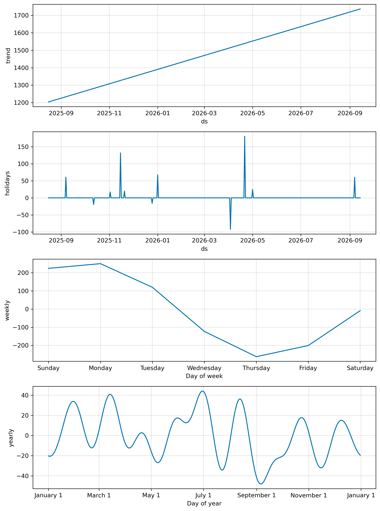
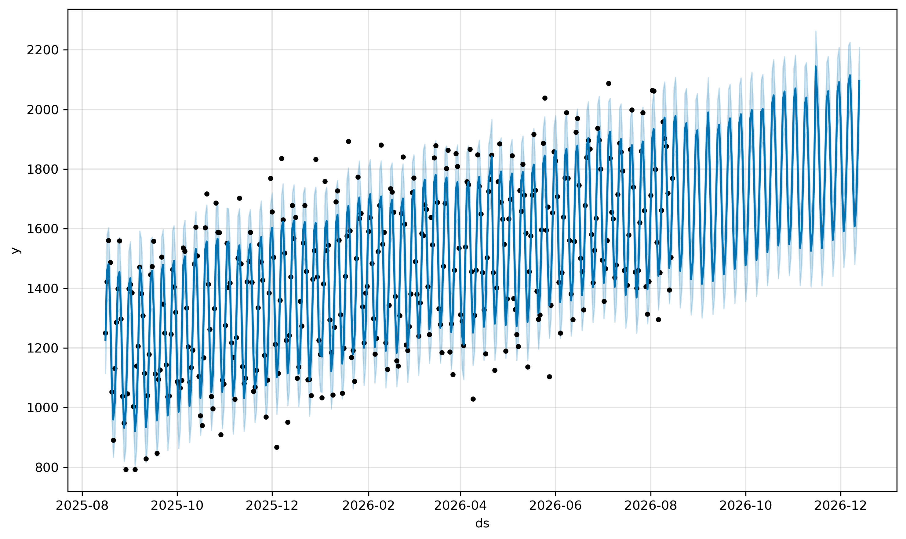
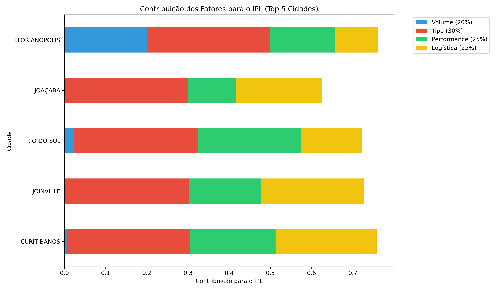

# 📊 Relatório Gerencial de Roteirização Preditiva
**Eduardo Lopes Jonker**
*Disciplina: Sistemas Inteligentes | UDESC*
*Gerado em: 2026-04-30 11:11:08.940698*

Este documento consolida os resultados do sistema de roteirização preditiva, utilizando inteligência de dados para otimização logística.

---

## 1. Análise Preditiva de Demanda

### 1.1. Projeção de Volume (30 Dias)


**Insight Chave:** O volume total previsto para os próximos 30 dias é de **50,353 unidades**.
**Acurácia (MAPE):** 5.07% (Média de Erro Percentual Absoluto).

### 1.2. Sazonalidade e Componentes


A análise de componentes permite identificar picos semanais e o impacto de feriados, permitindo um planejamento de frota muito mais assertivo.

### 1.3. Projeção de Longo Prazo (120 Dias)


---

## 2. Otimização e Priorização Logística (IPL)

O **Índice de Prioridade Logística (IPL)** normaliza volume, criticidade de serviço, performance e custos logísticos.




**Insight Chave:** A cidade prioritária é **FLORIANÓPOLIS**, com um IPL de **0.76**.

---

## 3. Planejamento de Suprimentos (Troca de Toners)
Estimativa baseada na capacidade de 10000 cópias por suprimento.

| Cidade | Volume Anual Previsto | Trocas de Toner Anual |
| :----- | :-------------------- | :-------------------- |
| FLORIANÓPOLIS | 102536 | 10.25 |
| BLUMENAU | 97221 | 9.72 |
| ITAJAÍ | 73110 | 7.31 |
| CHAPECÓ | 69870 | 6.99 |
| CRICIÚMA | 55189 | 5.52 |
| JARAGUÁ DO SUL | 47768 | 4.78 |
| LAGES | 40606 | 4.06 |
| BRUSQUE | 36037 | 3.60 |
| TUBARÃO | 25796 | 2.58 |
| CONCÓRDIA | 17953 | 1.80 |


---

## 4. Análise Financeira e Viabilidade (ROI)


**Conclusão Financeira:** A simulação de Monte Carlo com **10,000,000 iterações** indica uma economia média de **43.61%** no custo operacional.

---

## 5. Avaliação de Decisão: Matriz de Confusão

| Previsão | Realidade | Classificação | Impacto |
| :--- | :--- | :--- | :--- |
| Alta Demanda | Alta Demanda | ✅ VP | Sucesso na alocação de frota. |
| Alta Demanda | Baixa Demanda | ❌ FP | Desperdício de frete (ociosidade). |
| Baixa Demanda | Alta Demanda | ❌ FN | Quebra de SLA (atraso crítico). |
| Baixa Demanda | Baixa Demanda | ✅ VN | Economia validada (frota retida). |

---

## 6. Detalhamento Técnico

### 6.1. Equação do Prophet
``y(t) = g(t) + s(t) + h(t) + εt``

- `y(t)`: O volume de impressões previsto no tempo `t`.
- `g(t)`: A componente de tendência, representando o crescimento ou queda não-periódica.
- `s(t)`: A componente de sazonalidade, capturando padrões periódicos (semanal, anual).
- `h(t)`: A componente de feriados, ajustando a previsão para eventos específicos.
- `εt`: O termo de erro, representando variações não modeladas.

### 6.2. Snippets de Implementação

**Treinamento do Modelo:**
```python
        df = pd.read_csv(caminho_arquivo, sep=None, engine='python', encoding='utf-8-sig')
        
        # Prophet EXIGE que as colunas se chamem 'ds' (Data) e 'y' (Valor/Volume)
        # Mapeamento flexível das colunas do seu sistema
        col_map = {col: 'ds' for col in df.columns if 'data' in str(col).lower() or 'ds' in str(col).lower()}
        col_map.update({col: 'y' for col in df.columns if 'volume' in str(col).lower() or 'y' in str(col).lower() or 'impress' in str(col).lower()})
        
        df = df.rename(columns=col_map)
        
        # Tratamento do formato da data e de números brasileiros ("1.500,00" -> 1500.00)
        df['ds'] = pd.to_datetime(df['ds'], format='%d/%m/%Y', errors='coerce')
        df['y'] = df['y'].apply(lambda x: str(x).replace('.', '').replace(',', '.') if isinstance(x, str) else x)

```

**Cálculo do IPL:**
```python
# Cidades mais distantes/custosas recebem maior peso logístico
l_min, l_max = df_final['Dificuldade_Logistica'].min(), df_final['Dificuldade_Logistica'].max()
df_final['Logistica_Norm'] = (df_final['Dificuldade_Logistica'] - l_min) / (l_max - l_min) if l_max != l_min else 0.5

# Atribuição de Peso Semântico (Baseado na Ontologia)
# Perícias possuem peso 1.5 (Urgência Social) e SEA peso 1.0
df_final['Peso_Tipo'] = df_final['Tipo'].apply(lambda x: 1.5 if 'PERICIA' in str(x).upper() else 1.0)

# Cálculo do IPL (Índice de Prioridade Logística)
# Nova Fórmula com Performance e Logística
# Pesos distribuídos: Volume (20%), Tipo (30%), Performance (25%), Logística (25%)
df_final['IPL'] = (
    (df_final['Volume_Norm'] * 0.20) + 
    (df_final['Peso_Tipo'] * 0.30) +
    (df_final['Perf_Norm'] * 0.25) +
    (df_final['Logistica_Norm'] * 0.25)
)

def gerar_grafico_ipl(df):
    """Gera e salva um gráfico de barras com as maiores prioridades de IPL."""
    print("Gerando gráfico de prioridade IPL...")

```

---

## 7. Informações do Ambiente e Auditoria
- **SO:** Linux 6.14.0-15-generic (#15-Ubuntu SMP PREEMPT_DYNAMIC Sun Apr  6 15:05:05 UTC 2025)
- **Arquitetura:** x86_64
- **Python:** 3.13.11
- **Host:** eduardonote-Inspiron-15-3530