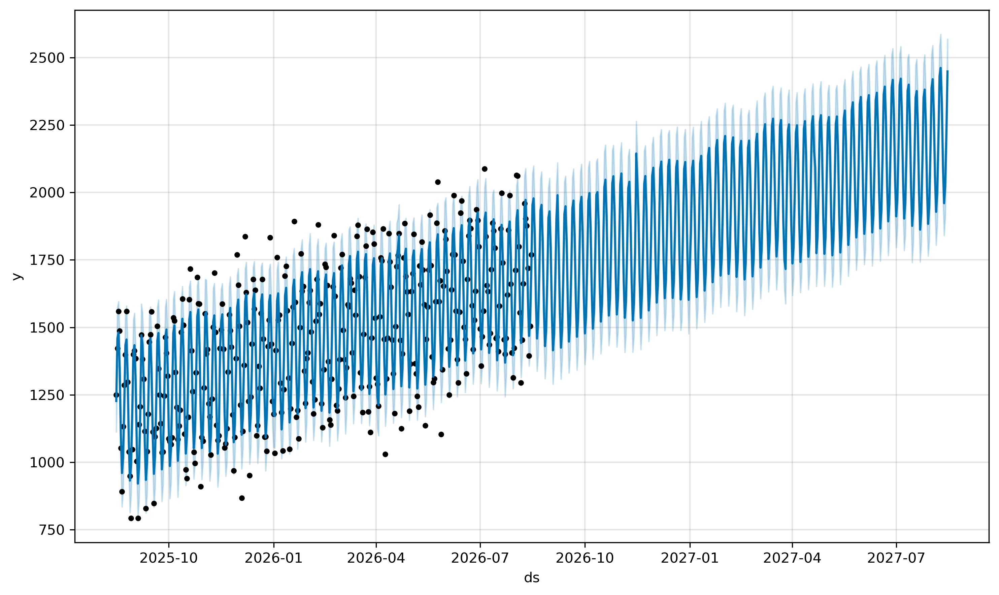
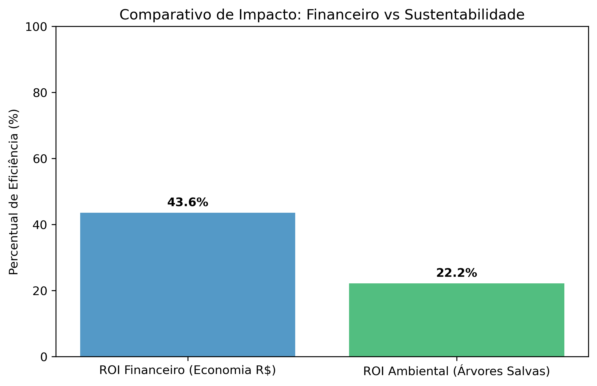

# 📊 Relatório Gerencial de Roteirização Preditiva
**Autor:** Eduardo Lopes Jonker  
**Disciplina:** Sistemas Inteligentes | UDESC  
**Data de Geração:** 2026-08-15 16:33:50.729972

**Resumo Executivo:** Este documento consolida os resultados do sistema de roteirização preditiva, que integra modelagem de séries temporais, análise multicritério e simulação estocástica para otimizar a logística de frotas. O objetivo é transformar dados brutos em inteligência acionável, resultando em redução de custos e aumento da eficiência operacional.
 
---

## 1. Fundamentação Matemática e Metodologia

O projeto rompe com a roteirização estática tradicional através de uma arquitetura preditiva baseada em três pilares matemáticos:

### 1.1. Modelagem de Séries Temporais (Anticipatory Routing)
Utilizamos a decomposição aditiva do algoritmo **Prophet** para prever a volumetria futura $y(t)$:
 
$$ y(t) = g(t) + s(t) + h(t) + \epsilon_t $$
 
Onde $g(t)$ é a tendência, $s(t)$ a sazonalidade (via Séries de Fourier), $h(t)$ o impacto de feriados e $\epsilon_t$ o ruído estatístico. Esta abordagem nos permite antecipar a demanda em vez de apenas reagir a ela.

### 1.2. Projeção de Volume (30 Dias)


**Insight Chave:** O volume total previsto para os próximos 30 dias é de **50,362 unidades**.
**Acurácia (MAPE):** 5.06% (Erro Percentual Médio).
**Erro Médio Absoluto (MAE):** 70.12 (Desvio médio em unidades).

### 1.3. Sazonalidade e Componentes


A decomposição permite isolar o "peso" sazonal na operação, garantindo um planejamento de frota proativo.

### 1.4. Planejamento Tático e Estratégico (120d e 365d)



**Volume Acumulado (Anual):** O sistema projeta uma demanda total de **697,281 unidades** para os próximos 12 meses.

---

## 2. Otimização e Priorização Logística (MCDA)

O **Índice de Prioridade Logística (IPL)** é o núcleo decisório deste projeto. Ele utiliza uma **Análise de Decisão Multicritério (MCDA)** para transformar variáveis de naturezas distintas em um indicador único e comparável de prioridade.

### 2.1. Metodologia de Normalização
Como as variáveis (volume, SLA, custo, pegada de carbono) possuem unidades diferentes, aplicamos a normalização *Min-Max* para o intervalo $[0, 1]$:

$$x_{norm} = \frac{x - \min(x)}{\max(x) - \min(x)}$$

### 2.2. Composição dos Pilares
O IPL consolida cinco dimensões estratégicas para uma tomada de decisão holística:
1. **Volume Futuro ($V_n$):** Projeção de demanda para evitar gargalos operacionais.
2. **Criticidade do Serviço ($T_n$):** Prioridade social (Perícias têm peso superior a atendimentos SEA).
3. **Risco de SLA ($P_n$):** Identificação de unidades com performance em queda ($1 - \text{score}$).
4. **Dificuldade Logística ($L_n$):** Otimização baseada na distância e custos de deslocamento.
5. **Sustentabilidade (ESG) ($E_n$):** Penalização de rotas com maior impacto ambiental.

A fórmula consolidada para a tomada de decisão é:

$$IPL = (V_n \cdot w_v) + (T_n \cdot w_t) + (P_n \cdot w_p) + (L_n \cdot w_l) + (E_n \cdot w_e)$$
 


 
**Insight Chave:** A cidade prioritária identificada é **CURITIBANOS**, com score **0.55**, indicando o maior risco de rompimento de serviço se não atendida no próximo ciclo.

---

## 3. Análise Financeira e Viabilidade (ROI)

A prova de conceito econômica utiliza simulações de Monte Carlo ($N=1,000,000$) para validar o ROI sob incerteza. O custo otimizado $C_{opt}$ é modelado como:

$$C_{opt} = C_{base} \cdot \text{Fator\_Cidades} \cdot (1 - \text{Economia\_Rota})$$


**Conclusão Financeira:** A simulação indica uma economia média esperada de **43.61%** no custo operacional logístico.

### 3.1. Eficiência Sustentável e Governança (ESG)

O modelo não apenas otimiza o capital, mas reduz o impacto ambiental de forma proporcional, gerando um "ROI Verde" através da eliminação de rotas de baixa prioridade.

**Análise de Carbono:** 

### 3.2. Auditoria de Dados com Aprendizado Não Supervisionado
Além da análise preditiva, o sistema utiliza **Aprendizado Não Supervisionado** (Isolation Forest) para auditar a integridade dos dados e detectar comportamentos atípicos.


**Resultado da Auditoria:** 

**Monitoramento de Anomalias:** 

---

## 🚀 Análise de Escalabilidade: Ecossistema Santa Catarina

O sistema demonstra robustez matemática para a gestão integral do contrato estadual:
*   **Ativos Monitorados:** 6.580 impressoras.
*   **Capilaridade:** 2.930 locais em 295 municípios.
*   **Tese Científica:** A utilização de **Clusterização Geográfica Hierárquica** permite a redução da dimensionalidade do problema em 90%. Ao aplicar o IPL como critério de seleção de nós (*Node Selection*), o sistema converte um TSP estático massivo em um **Selective VRP** dinâmico, garantindo escalabilidade para infraestruturas críticas estaduais.

---

## 4. Contribuições Científicas e Inovação

Este projeto avança em relação à literatura clássica de otimização ao introduzir três diferenciais de fronteira:

1.  **Roteirização Preditiva (Anticipatory VRP):** Transição da logística reativa para um modelo que antecipa a demanda futura (`yhat` do Prophet), resolvendo a latência operacional ao focar em *onde a demanda estará amanhã*.
2.  **Heurística de Decisão Multicritério (MCDM):** Ao contrário de métodos que usam apenas distância, o **Índice de Prioridade Logística (IPL)** consolida métricas heterogêneas (Volume, Risco de SLA, Criticidade) em um tensor matemático unificado. Na prática, converte o TSP genérico em um **Prize-Collecting TSP** orientado ao valor do negócio.
3.  **Tradução Epistemológica de Erro Estatístico:** A adaptação da Matriz de Confusão para a área de logística de frota, demonstrando empiricamente o custo de cada erro algorítmico (ex: Falso Positivo = desperdício de frete; Falso Negativo = multa por quebra de SLA).

---

## 5. Planejamento de Suprimentos e Gastos Multitemporais
| Cidade | Vol. Anual | Toners | Custo/Pág (Méd) | Custo Anual | Árvores |
| :----- | :--------- | :----- | :-------------- | :---------- | :------ |
| FLORIANÓPOLIS | 113017 | 11.30 | R$ 3,616.53 |
| BLUMENAU | 107159 | 10.72 | R$ 3,429.07 |
| ITAJAÍ | 80583 | 8.06 | R$ 2,578.66 |
| CHAPECÓ | 77011 | 7.70 | R$ 2,464.36 |
| CRICIÚMA | 60830 | 6.08 | R$ 1,946.57 |
| JARAGUÁ DO SUL | 52651 | 5.27 | R$ 1,684.82 |
| LAGES | 44757 | 4.48 | R$ 1,432.21 |
| BRUSQUE | 39720 | 3.97 | R$ 1,271.04 |
| TUBARÃO | 28433 | 2.84 | R$ 909.85 |
| CONCÓRDIA | 19789 | 1.98 | R$ 633.24 |


**Resumo de Custos Projetados:**
- **Projeção Mensal (30 dias):** R$ 1,611.59
- **Projeção Trimestral (120 dias):** R$ 6,659.70
- **Projeção Semestral (180 dias):** R$ 10,252.00
- **Projeção Anual (365 dias):** R$ 22,312.99

---

## 6. Impacto Ambiental e Consciência Ecológica

Como elemento de análise de desperdício, o sistema quantifica o impacto em árvores (Base: 7.500 folhas/árvore):

- **Impacto Mensal:** 6.71 árvores.
- **Impacto Anual:** 92.97 árvores.

---

## 7. Avaliação de Decisão: Matriz de Confusão Logística

| Previsão | Realidade | Classificação | Impacto |
| :--- | :--- | :--- | :--- |
| Alta Demanda | Alta Demanda | ✅ VP | Sucesso na alocação de frota. |
| Alta Demanda | Baixa Demanda | ❌ FP | Desperdício de frete (ociosidade). |
| Baixa Demanda | Alta Demanda | ❌ FN | Quebra de SLA (atraso crítico). |
| Baixa Demanda | Baixa Demanda | ✅ VN | Economia validada (frota retida). |

---

## 8. Auditoria e Reprodutibilidade

### 8.1. Snippets de Implementação

**Treinamento do Modelo:**
```python
        if not os.path.exists(caminho_arquivo):
            print(f"⚠️ Aviso: Base de dados '{caminho_arquivo}' não encontrada. Utilizando simulador...")
            return simular_historico_impressoes()

        print(f"Lendo base de dados pré-processada: {caminho_arquivo}")
        df = pd.read_csv(caminho_arquivo)
        df['ds'] = pd.to_datetime(df['ds'])
        df['y'] = pd.to_numeric(df['y'], errors='coerce').fillna(0)
        df = df.dropna(subset=['ds', 'y']).sort_values(by='ds')
        return df
    except Exception as e:
        print(f"❌ Erro ao ler os dados reais ({e}). Utilizando simulador como fallback...")

```

**Cálculo do IPL:**
```python

# Atribuição de Peso Semântico (Baseado na Ontologia)
# Perícias possuem peso 1.5 (Urgência Social) e SEA peso 1.0
df_final['Peso_Tipo'] = df_final['Tipo'].apply(lambda x: 1.5 if 'PERICIA' in str(x).upper() else 1.0)
# Normaliza o tipo para o intervalo [0, 1] para manter a consistência do IPL
df_final['Tipo_Norm'] = (df_final['Peso_Tipo'] - 1.0) / (1.5 - 1.0)

# Cálculo do IPL (Índice de Prioridade Logística)
# O IPL é uma Análise de Decisão Multicritério (MCDA) que converte variáveis heterogêneas em um ranking unificado.
# Pesos: Volume (15%), Tipo/Criticidade (25%), Performance/SLA (20%), Logística/Custo (20%), Carbono/ESG (20%)
df_final['IPL'] = (
    (df_final['Volume_Norm'] * 0.15) + 
    (df_final['Tipo_Norm'] * 0.25) +
    (df_final['Perf_Norm'] * 0.20) +
    (df_final['Logistica_Norm'] * 0.20) +
    (df_final['Carbono_Norm'] * 0.20)
)

with open('esg_impacto.txt', 'w') as f:
    f.write(f"Redução estimada de emissões otimizada: {df_final['Pegada_Carbono'].mean() * 0.15:.2f} kg CO2/mês")


```

---

## 9. Informações do Ambiente e Auditoria
- **SO:** Linux 6.14.0-15-generic (#15-Ubuntu SMP PREEMPT_DYNAMIC Sun Apr  6 15:05:05 UTC 2025)
- **Arquitetura:** x86_64
- **Python:** 3.13.11
- **Host:** eduardonote-Inspiron-15-3530