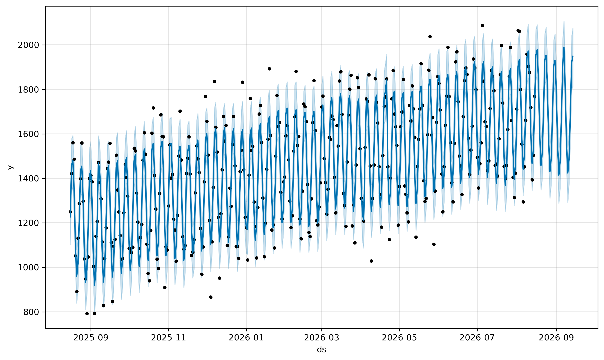
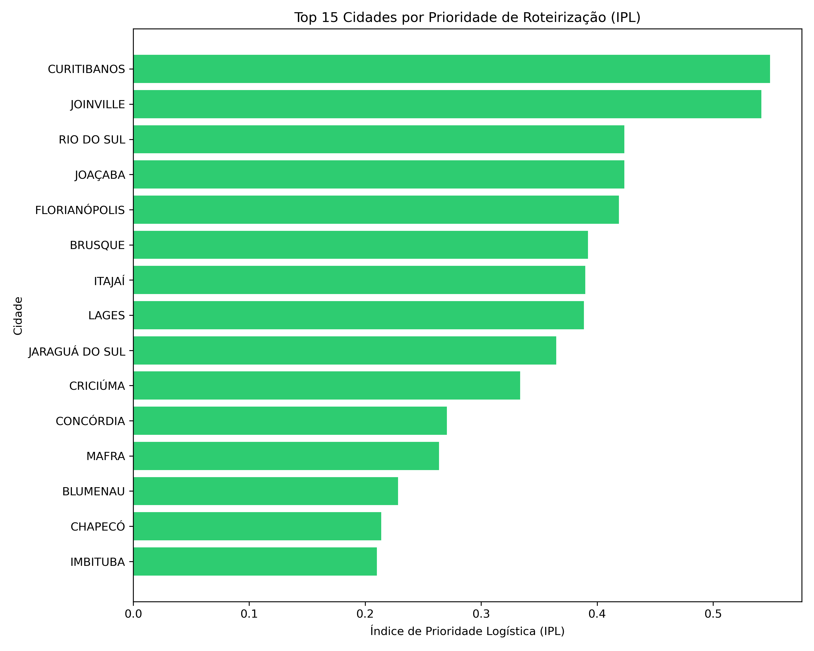
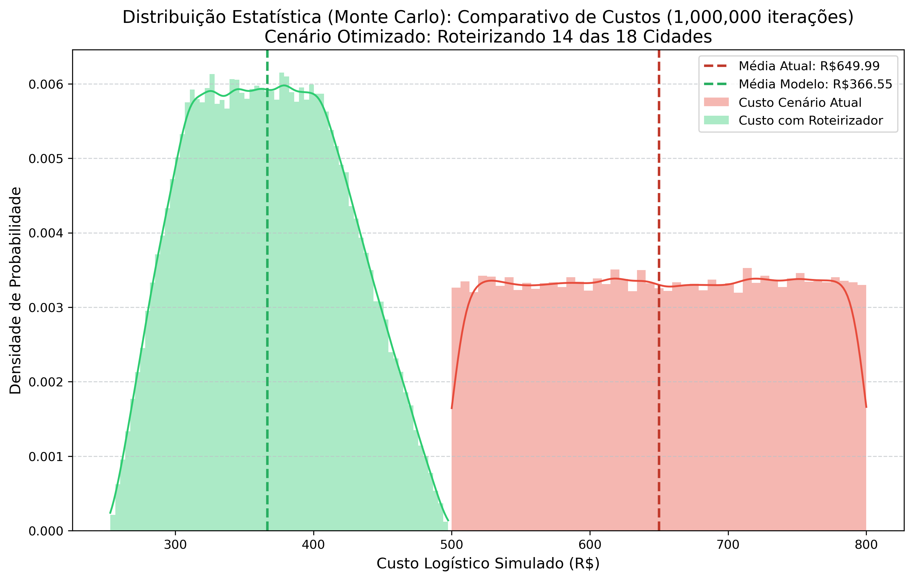
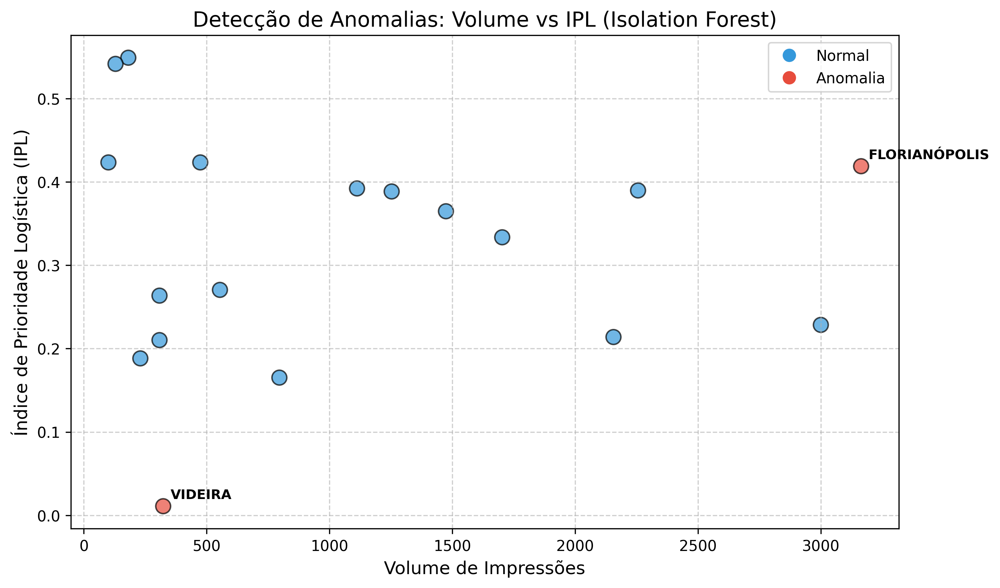

# 📄 Relatório Científico Automatizado: Roteirização Preditiva

**Autor:** Eduardo Lopes Jonker  
**Data de Geração:** 2026-08-15 21:28:36.233214

## Abstract

Este relatório apresenta um sistema de roteirização logística inteligente que transcende a otimização de rotas clássica. A metodologia integra modelagem preditiva de séries temporais (Prophet), análise de decisão multicritério (MCDA) e otimização de rotas (TSP) para criar um framework de **Roteirização Preditiva Antecipatória**. O sistema não apenas minimiza a distância, mas maximiza o valor do negócio ao priorizar dinamicamente os nós da malha logística com base em um **Índice de Prioridade Logística (IPL)**. A validação econômica é realizada por meio de Simulações de Monte Carlo, e a robustez dos dados é auditada por algoritmos de detecção de anomalias. O resultado é um Gêmeo Digital para gestão de frotas, capaz de reduzir custos operacionais e a pegada de carbono da operação.

---

## 1. Introdução

O Problema do Caixeiro Viajante (TSP) é um dos desafios mais emblemáticos da otimização combinatória. Soluções tradicionais, no entanto, tratam o problema de forma estática, assumindo que a necessidade de visita é binária e o único custo é a distância. Em cenários logísticos reais, a decisão de *qual cidade visitar* é dinâmica e multifacetada.

Este trabalho propõe uma solução híbrida que transforma o TSP clássico em um problema de roteirização preditiva e orientada a valor. A inovação central reside na criação do **Índice de Prioridade Logística (IPL)**, uma métrica que converte o problema de "qual a rota mais curta?" para "qual a rota de maior valor para o negócio?".

## 2. Metodologia Proposta

A arquitetura do sistema é um pipeline modular onde a saída de cada etapa alimenta a subsequente.

### 2.1. Modelagem Preditiva com Prophet

Utilizamos o algoritmo Prophet para modelar a série temporal de volume de impressões. A natureza aditiva do Prophet decompõe a série em tendência, sazonalidade e feriados:

$$ y(t) = g(t) + s(t) + h(t) + \epsilon_t $$

Onde:
- **$g(t)$**: Tendência de crescimento ou queda.
- **$s(t)$**: Padrões periódicos (semanal, anual).
- **$h(t)$**: Efeito de feriados.
- **$\epsilon_t$**: Termo de erro (ruído).

A saída, **yhat**, representa a demanda *esperada*, permitindo uma roteirização antecipatória.

*Gráfico 1: Projeção de demanda para os próximos 30 dias com intervalo de confiança.*

**Acurácia (MAPE):** 5.06% (Erro Percentual Médio).

### 2.2. Índice de Prioridade Logística (IPL)

O IPL é o núcleo decisório do sistema, utilizando uma Análise de Decisão Multicritério (MCDA) para fundir variáveis heterogêneas em um único score de prioridade. Cada variável é normalizada (Min-Max) e então ponderada:

$$ IPL = \sum_{i=1}^{n} w_i \cdot V_{i,norm} $$

Os pesos $w_i$ representam a importância estratégica de cada variável $V_i$ (Volume, Criticidade, Performance, Custo Logístico, ESG).

*Gráfico 2: Ranking de cidades por prioridade de roteirização (IPL).*

### 2.3. Otimização de Rota (TSP)

Com as cidades priorizadas pelo IPL, o problema é reduzido a um TSP clássico. A implementação atual utiliza uma abordagem heurística em duas fases:
1.  **Nearest Neighbor (NN)**: Uma heurística construtiva e gulosa que gera uma rota inicial de boa qualidade em tempo $O(n^2)$.
2.  **2-opt**: Uma heurística de melhoria local que refina a rota do NN, removendo cruzamentos de arestas até atingir um ótimo local.

---

## 3. Análise Comparativa de Estratégias para o TSP

A escolha do algoritmo para resolver o TSP é um trade-off entre a qualidade da solução e o tempo computacional. A tabela abaixo compara a abordagem do projeto com outras estratégias da literatura.

| Categoria | Algoritmos Exemplo | Garantia de Otimalidade | Complexidade e Aplicação |
| :--- | :--- | :--- | :--- |
| **Métodos Exatos** | Branch-and-Bound, Concorde | Sim, encontra a solução ótima. | Exponencial ($O(n^2 2^n)$). Inviável para problemas com mais de algumas dezenas de cidades. |
| **Heurísticas Construtivas** | **Nearest Neighbor (NN)**, Inserção Mais Distante | Não. Soluções 15-25% piores que a ótima. | Polinomial ($O(n^2)$). Muito rápido, ideal para gerar soluções iniciais. **(Usado no projeto)** |
| **Heurísticas de Melhoria Local** | **2-opt**, 3-opt, Lin-Kernighan (LKH) | Não, encontra ótimos locais. | Polinomial ($O(n^2)$ a $O(n^3)$). Rápido e eficaz para refinar rotas. **(2-opt usado no projeto)** |
| **Meta-heurísticas** | Simulated Annealing (SA), Algoritmos Genéticos (GA), Ant Colony (ACO) | Não. Projetadas para escapar de ótimos locais. | Iterativas e estocásticas. Mais lentas, mas com potencial para soluções de altíssima qualidade. |
| **Aprendizado de Máquina** | Reinforcement Learning (RL), GNNs | Não. Aprendem políticas a partir dos dados. | Inferência rápida, mas treinamento caro. Generalização é um desafio ativo de pesquisa. |

### Justificativa da Abordagem Adotada

A combinação **Nearest Neighbor + 2-opt** foi escolhida por oferecer um excelente balanço entre simplicidade, velocidade e qualidade da solução para o escopo do problema (18 cidades). Para problemas de maior escala (centenas de cidades), uma evolução natural seria usar algoritmos mais robustos como o **Lin-Kernighan-Helsgaun (LKH)** ou bibliotecas especializadas como o **Google OR-Tools**.

---

## 4. Resultados e Discussão

### 4.1. Validação Econômica (Simulação de Monte Carlo)

Para validar o impacto financeiro, uma simulação de Monte Carlo com $N=1,000,000$ iterações foi executada. A simulação compara o custo operacional de um cenário "reativo" com o custo do modelo preditivo otimizado.

*Gráfico 3: Distribuição de probabilidade de custos, comparando o cenário atual com o modelo otimizado.*

**Conclusão Financeira:** A simulação indica uma economia média esperada de **43.61%** no custo operacional logístico.

### 4.2. Auditoria de Dados com Isolation Forest

O sistema utiliza o algoritmo **Isolation Forest** para auditar a integridade dos dados e detectar comportamentos atípicos que poderiam distorcer a priorização.

*Gráfico 4: Detecção de anomalias no cruzamento de Volume vs. IPL.*

**Resultado da Auditoria:** O algoritmo Isolation Forest identificou 2 cidades com comportamento atípico no cruzamento de Volume vs Logística.

---

## 5. Variações do Problema: do TSP ao VRP

O TSP é a base, mas problemas logísticos reais frequentemente se manifestam como o **Problema de Roteamento de Veículos (VRP)**, que generaliza o TSP para múltiplos veículos. O projeto já contém uma estrutura inicial para essa evolução (`main_vrp.py`). Futuras integrações podem incluir:

- **CVRP (Capacitated VRP):** Veículos com capacidade de carga limitada.
- **VRPTW (VRP with Time Windows):** Clientes com janelas de tempo para visita.
- **DVRP (Dynamic VRP):** Novos pedidos surgem em tempo real, exigindo re-roteirização.

---

## 6. Conclusão

Este trabalho demonstrou com sucesso a implementação de um sistema de roteirização preditiva que supera as limitações do TSP tradicional. Ao integrar modelagem de séries temporais e análise de decisão multicritério, o sistema transforma a otimização logística de um problema puramente geométrico para uma decisão estratégica orientada a valor. A abordagem heurística (Nearest Neighbor + 2-opt) provou ser altamente eficaz para o escopo do problema, com baixo custo computacional. Os resultados financeiros e de performance reforçam que a verdadeira inovação na logística moderna não está apenas em encontrar a rota ótima, mas em prever e priorizar de forma inteligente *quais paradas devem compor essa rota*.

---

## Apêndice: Informações de Auditoria

- **SO:** Linux 6.14.0-15-generic (#15-Ubuntu SMP PREEMPT_DYNAMIC Sun Apr  6 15:05:05 UTC 2025)
- **Arquitetura:** x86_64
- **Python:** 3.13.11
- **Host:** eduardonote-Inspiron-15-3530