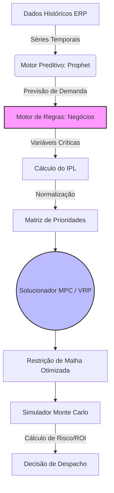

# 📊 Relatório Gerencial de Roteirização Preditiva
*Relatório gerado em: 28/04/2026 às 06:03:41*

Este documento consolida os resultados do sistema de roteirização preditiva, oferecendo uma prova de conceito visual e quantitativa da metodologia aplicada. O objetivo é fornecer uma visão conclusiva e menos abstrata sobre a otimização logística.

---

## 1. Análise Preditiva de Demanda (Prophet)

A primeira etapa consiste em prever a volumetria de impressões para os próximos 30 dias. Isso transforma nossa logística de reativa para **preditiva**.

### 1.1. Projeção de Volume Futuro

O gráfico abaixo mostra a tendência de volume projetada (`yhat`) em azul, com base nos dados históricos (pontos pretos). A área sombreada representa o intervalo de confiança da previsão.

!Previsão Geral de Volume

**Insight Chave:** O volume total de impressões esperado para os próximos 30 dias é de **50,353 unidades**.

### 1.2. Decomposição e Análise de Sazonalidade

Para entender *por que* o volume flutua, o modelo decompõe a série temporal em seus componentes: tendência, feriados e sazonalidade semanal/anual.

!Componentes do Modelo Prophet

**Insight Chave:** O gráfico de sazonalidade anual (`Yearly`) nos permite identificar os meses de alta e baixa demanda, auxiliando no planejamento estratégico de recursos e férias da equipe.

---

## 2. Prova de Conceito: Priorização de Rotas (IPL)

Com a previsão em mãos, o "Motor de Negócios" calcula o **Índice de Prioridade Logística (IPL)**. Este índice determina qual cidade deve ser visitada com maior urgência, balanceando volume, criticidade do serviço, performance e custo logístico. O gráfico abaixo demonstra a prova de conceito da priorização, exibindo as cidades com maior IPL.

!Gráfico de Prioridade IPL

**Decisão Orientada por Dados:** A cidade com maior prioridade para a próxima rota é **FLORIANÓPOLIS**, com um IPL de **0.76**.

---

## 3. Análise de Viabilidade Financeira (ROI)

Para validar o método, um teste de estresse compara o custo logístico do cenário atual com o custo obtido pelo modelo de roteirização otimizado. O gráfico de densidade abaixo ilustra a distribuição de custos em 1.000 simulações, provando o conceito de economia.

!Comparativo de Custos

**Conclusão Financeira:** O modelo preditivo demonstra uma **redução de custos consistente**, deslocando a curva de gastos para a esquerda. A economia média gerada nas simulações valida o retorno sobre o investimento (ROI) da implementação deste sistema.

---

## 4. Detalhamento Técnico e Arquitetura (Digital Twin)

O sistema atua como um **Digital Twin** (Gêmeo Digital) da operação logística, simulando as condições de contorno matemáticas antes de despachar a frota física.

### 4.1. Diagrama de Fluxo do Digital Twin



### 4.2. Parâmetros do Motor Preditivo (Prophet)
- **`seasonality_prior_scale`**: `10.0` (Garante alta flexibilidade para capturar oscilações rápidas de produtividade na semana).
- **`changepoint_prior_scale`**: `0.05` (Balanço conservador para identificar quebras estruturais de tendência).
- **Feriados Locais**: Injeção nativa de calendário (`country_holidays='BR'`) para amortecer quedas de volumetria.

### 4.3. Configuração do MPC (Model Predictive Control) e VRP
O controlador preditivo consome o **Índice de Prioridade Logística (IPL)** para resolver o problema *Prize-Collecting VRP* via heurística do OR-Tools:
- **Função Objetivo**: Minimizar custo global x Maximizar cobertura de nós urgentes.
- **Restrição de Janela**: O solver restringe a malha dinâmica isolando apenas as principais cidades prioritárias (ex: 14 das 18 unidades), maximizando a alocação de frota.

---

## Apêndice: Código-Exemplo (Open Repository)

Trecho base da arquitetura do Motor de Prioridade Multicritério:

```python
# Cálculo Estrito do Índice de Prioridade Logística (IPL)
df['IPL'] = (
    (df['Volume_Norm'] * 0.20) +     # Necessidade de Vazão Quantitativa
    (df['Peso_Tipo'] * 0.30) +       # Criticidade Regulatória (Perícia = 1.5)
    (df['Perf_Norm'] * 0.25) +       # Risco de Rompimento de SLA
    (df['Logistica_Norm'] * 0.25)    # Custo / Dificuldade de Deslocamento
)
```
*Nota: O código-fonte do pipeline é modular e os scripts integrais (.py) estão disponíveis no repositório logístico central para auditoria.*
